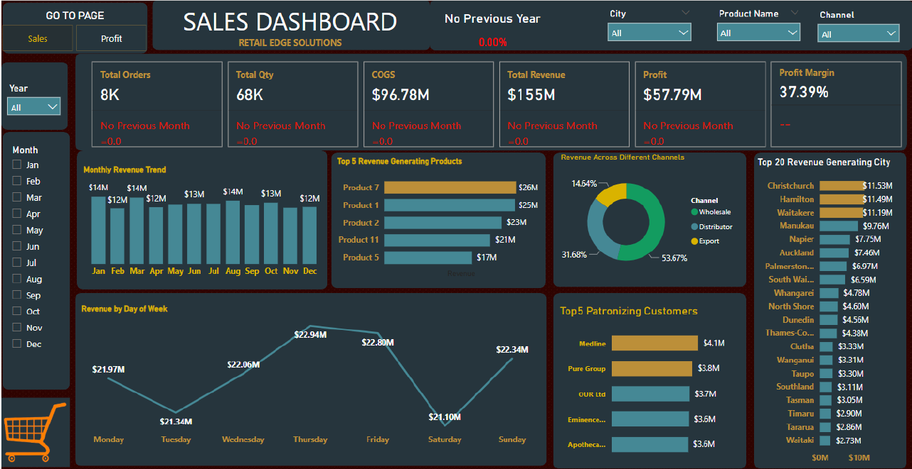
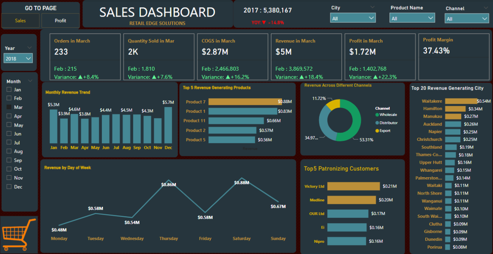
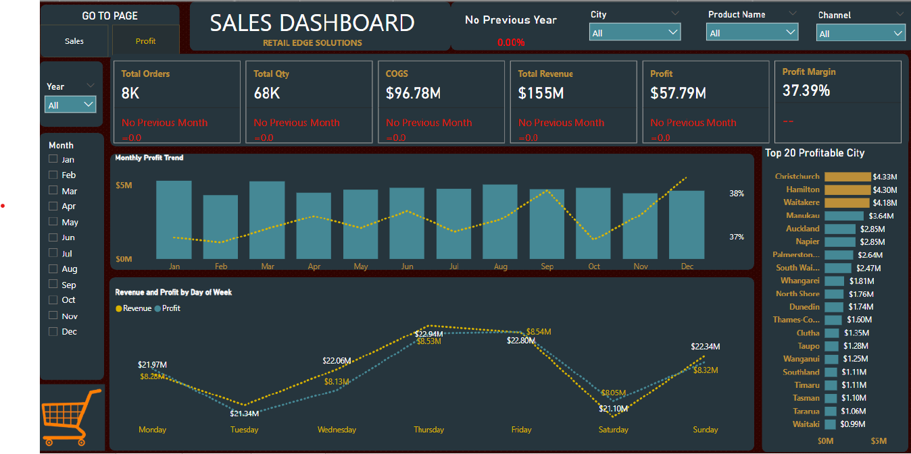
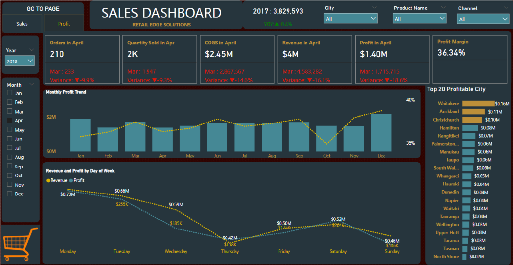

# RetailEdge Solutions: Enhancing Sales Analytics with Power BI

## Table of Contents
1. [Project Overview](#project-overview)  
2. [Business Introduction](#business-introduction)  
3. [Problem Statement](#problem-statement)  
4. [Project Objectives](#project-objectives)  
5. [Tools & Tech Stack](#tools--tech-stack)  
6. [Key Insights & Findings](#key-insights--findings)  
7. [Dashboard Structure](#dashboard-structure)  
8. [Dashboard Links](#dashboard-links)  
9. [Strategic Implications](#strategic-implications)  
10. [Technical Implementation](#technical-implementation)  
11. [Conclusion](#conclusion)  

## Project Overview
This project focuses on enhancing sales analytics for **RetailEdge Solutions**, a retail company operating in multiple cities. The goal is to transform static sales reports into interactive, real-time dashboards using Power BI, empowering stakeholders with actionable insights for informed decision-making.

## Business Introduction
**RetailEdge Solutions** is a rapidly expanding retail company specializing in electronics, household goods, and personal care products. With operations across several cities and both physical and e-commerce channels, the company is focused on leveraging data analytics to improve sales tracking and financial reporting.

## Problem Statement
RetailEdge Solutions faced the following challenges:
- Lack of dynamic, real-time visualization tools for their sales data.
- Difficulty in comparing year-over-year performance across cities and product categories.
- Management required a comprehensive dashboard to analyze trends, identify top-performing products, and understand customer preferences.

## Project Objectives
- Develop an **interactive Power BI dashboard** to visualize key sales metrics.
- Provide actionable insights into **top-performing cities, products, and customer segments**.
- Include **year-over-year comparisons** to highlight growth trends.
- Enable **dynamic filtering** using slicers for Date, City, Product, and Channel.
- Deliver a user-friendly dashboard to support **data-driven decision-making**.

## Tools & Tech Stack
- **Power BI**
- **Power Query** (Data Transformation)
- **DAX (Data Analysis Expressions)**
- **Power BI Service** (Sharing and collaboration)
- **Power BI Gateway & Data Refresh** (Automated data updates)

## Key Insights & Findings
### KPIs Summary:
- **Total Orders**: 8,000  
- **Total Quantity Sold**: 68,000 units  
- **Cost of Goods Sold (COGS)**: $96.78M  
- **Total Revenue**: $155M  
- **Profit**: $57.79M  
- **Profit Margin**: 37.39%  

### Revenue and Profit Trends:
- **Monthly Revenue**: Peaks in January, April, and December (approx. $14M each).  
- **Revenue by Day of the Week**:  
  - Thursday: Highest revenue ($22.94M)  
  - Friday: $22.88M  
  - Tuesday: Lowest revenue ($21.34M)  
- **Profit Trends**:  
  - December shows the highest profit.  
  - Thursday and Friday are the most profitable days, while Saturday shows a drop in profit relative to revenue.  

### Top Performers:
- **Top Revenue-Generating Cities**: Christchurch, Hamilton, Waitakere.  
- **Top Products by Revenue**:  
  - Product 7 ($26M)  
  - Product 1 ($25M)  
- **Top Customers by Spend**:  
  - Medline ($4.1M)  
  - Pure Group ($3.8M)  

### Distribution Channels:
- Distributor Channel: 52.67% of total revenue  
- Wholesale: 31.68%  
- Export: 14.54%  

## Dashboard Structure
The dashboards are split into two main pages for clear insights and easy navigation:

### 1. Sales Dashboard
**Focus**: Revenue-focused metrics and trends  
- **Monthly Revenue Trend**  
- **Revenue by Day of Week**  
- **Top 5 Revenue-Generating Products**  
- **Revenue Across Different Channels**  
- **Top 5 Patronizing Customers**  
- **Top 20 Revenue-Generating Cities**  

### 2. Profit Dashboard
**Focus**: Profit metrics and profitability analysis  
- **Monthly Profit Trend**  
- **Revenue and Profit by Day of Week**  
- **Top 20 Profitable Cities**  
- **Overall Profit Margin (37.39%)**  
- **Relationship between revenue (yellow dotted line) and profit (teal line)**  

## Dashboard Links
### Sales Dashboard
  
_Interactive view of total sales, top regions, product categories, and seasonal trends._

### Sales Dashboard - March Highlight  
  
_March sales performance, highlighting peak periods and regional trends._

### Profit Dashboard  
  
_Comprehensive analysis of profit margins, distribution channels, and product profitability._

### Profit Dashboard - April Focus  
  
_Focus on April profit margins, distribution channels, and product profitability._

## Strategic Implications
- **Optimize profit margins** in high-sales but low-margin regions.  
- **Replicate successful regional strategies** in underperforming markets.  
- **Refine product mix** to focus on high-margin offerings.  
- **Enhance distribution channel efficiency** based on performance insights.  

## Technical Implementation
- **Real-Time Data Visualization**: Dashboards automatically update as new data is added.  
- **Advanced Analytics**: Custom DAX measures for YoY growth, profitability ratios, and customer segmentation.  
- **Multi-Dimensional Filtering**: Slicers for Date, Region, Product Category, and Sales Channel.  
- **Integrated Performance Tracking**: KPIs and trend analysis designed for actionable insights.  
- **Data Refresh Strategy**: Automated via Power BI Gateway with scheduled refreshes to ensure up-to-date reporting.  

## Conclusion
The interactive Power BI dashboards developed for **RetailEdge Solutions** have significantly enhanced the company’s ability to analyze and act on sales and profitability data. These dashboards deliver clear, actionable insights, enabling management to make informed decisions that drive business growth and operational efficiency.

## Future Enhancements
- Implement predictive analytics for sales forecasting.  
- Add customer segmentation based on purchase behavior.  
- Integrate external data sources for market trend analysis.
